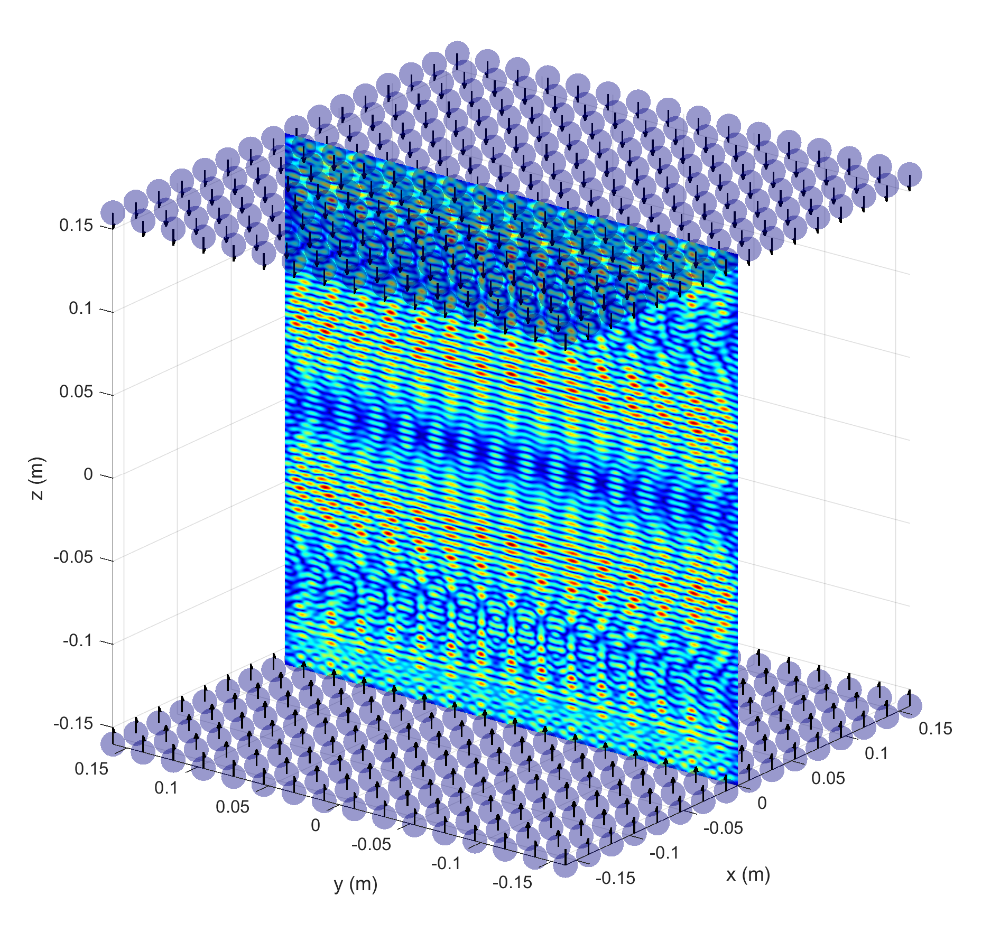
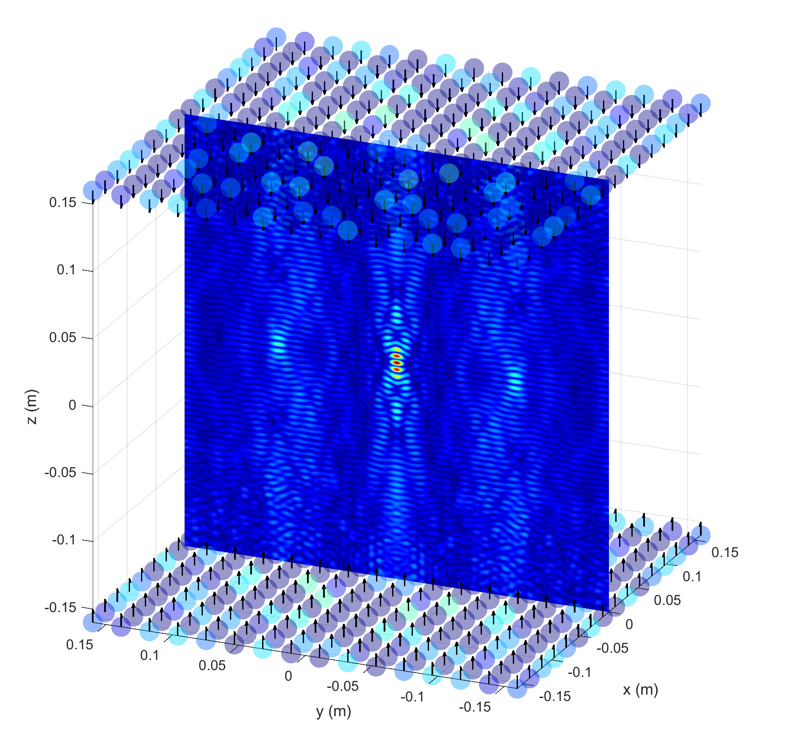
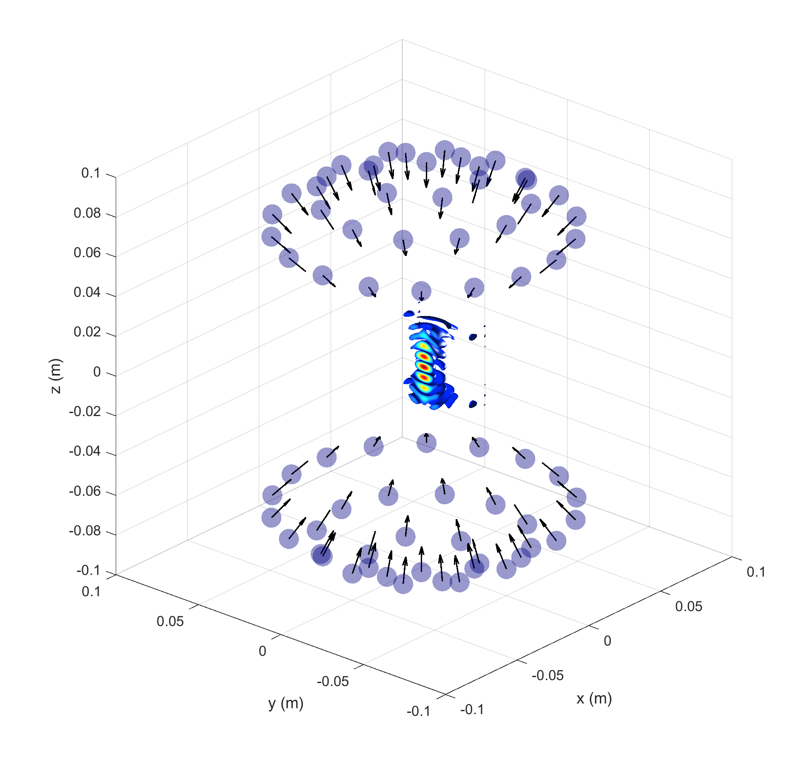
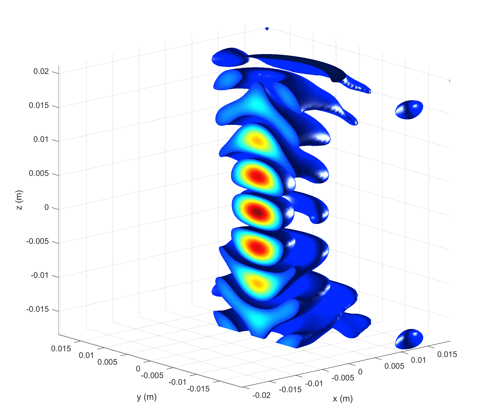
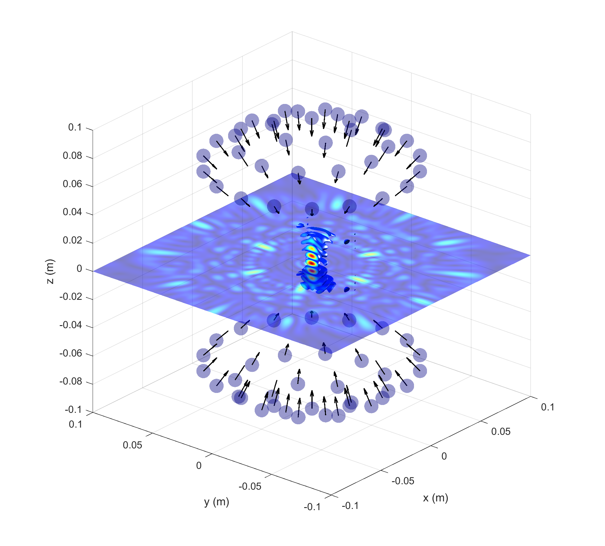

# phased array sim
### Acoustic phased array modelling and visualization tool written in MATLAB

This tool was created to help with validating novel ultrasonic phased array designs. It uses MATLAB's Parallel Computing Toolbox to 
utilize the GPU for better performance.

Phased array sim is also capable of optimizing the transducer phases to correspond to an arbitrary pressure field, such as a particle trap.

This tool can also visualize pressure data using 3D isosurfaces.

Phased array sim can display multiple slices and volumes at once, each with custom alpha values.

This tool uses the following paper as the basis for pressure field calculations.
[Holographic acoustic elements for manipulation of levitated objects](https://www.nature.com/articles/ncomms9661)